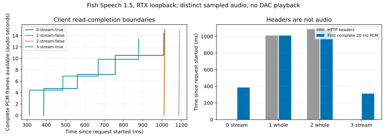

# 12-7：真实 TTS 音频接收与客户端取消边界

**部分完成。** 四次真实 Fish Speech 合成收到完整 PCM，另一次在首段收到后主动取消。流式 WAV 先到文件头，不能把这个时刻当成音频可播放；本次首个完整 20 ms PCM 帧在流式条件为 312–386 ms，整段返回为 1010–1087 ms。尚未运行 Queqiao 隧道或物理音频播放，因此没有可报告的真实播放停顿或后端取消耗时。



## 实际服务与协议

复用 RTX 原有 Fish Speech 1.5 服务，PID 1953199，loopback 8123；未重启、修改或终止服务。模型 checkpoint revision `275a984d33c33659e39eed41ff5bcd6e67517f4c`。服务实际自报 cuda、compile_graphs=true，固定服务源码在 [sources/server.py](sources/server.py)，请求前后的 deployment 身份完全相同，service SHA 与源码一致。只保存相关部署身份；未读写或复制其他用户的声音参考文件。

[事前协议](PROTOCOL.md)规定流式 true/false/false/true 四轮 ABBA，只改变 streaming；文本、chunk_length 80、max_new_tokens 512、temperature .7、top_p .7、repetition_penalty 1.2 不变。文本为实验测量说明，未选择命名声音，未提交参考声音。共享且已经运行的服务，非独占、非冷启动基准。客户端使用 RTX 系统 Python 标准库，每次新 HTTP 连接；所有请求依次执行，主动取消放在最后。

实际模型输出为 mono / 44100 Hz / signed PCM16 little endian。四次完整 PCM 长度及哈希不同：服务没有此接口的固定 seed 控制，故不是音频质量匹配的严格速度实验。非零样本和合法 WAV 格式不等于听辨、转写或质量验收。本轮未复制完整模型权重或独立重建全部运行依赖；部署身份绑定现有服务，不能冒称完全可移植的模型复现。

## 全部记录

|轮次|模式|响应头 ms|首个完整 20 ms PCM 帧 ms|读完／关闭 ms|收到音频 s|
|---|---|---:|---:|---:|---:|
|0|流式|0.555|386.283|1009.458|14.489|
|1|整段|1010.098|1010.231|1014.884|15.186|
|2|整段|1086.933|1087.061|1090.391|14.814|
|3|流式|0.677|312.007|878.289|13.421|
|4|主动取消，流式|3.891|376.648|377.033|0.046，截断|

计时从提交请求前开始，用客户端 perf_counter_ns；每次 read1(4096) 返回时记录时间、偏移、实际字节。它记录客户端可用边界，不能分离包到达、服务生成、队列等待或精确网络分块。先跳过 44-byte WAV 头，再累计 1764 byte 才足够完整 20 ms PCM。图中的纵轴是已到达的完整帧覆盖的音频秒数；尾部不足 20 ms 的样本仍完整保存在原件中。

取消请求实际收到 4096 byte PCM 后关闭。调用关闭在请求后 376.706 ms，返回在 377.024 ms；这是本地 close 调用区间。没有取消回执、服务端完成时刻或 GPU 停止时刻。源码在 BrokenPipe/ConnectionReset 时返回 HTTP handler，但语义生成使用独立队列，不能据此推出正在生成的任务立刻被撤销。第五份截断 WAV 是事前故障注入原件，必须保留。

四次完整记录是正式重复，保留全部成功原件和随机性，不仅保留最有利的一次。服务已有的五个 GPU 进程在请求后仍可见；Fish 显存 6666 MiB，与本轮前观察一致，未因实验杀任务。

## 独立复现与分析

在可访问本机 `127.0.0.1:8123` 固定服务的 RTX 环境中运行：

```sh
python3 run.py
python3 analyze.py
python3 prepare_replay.py
python3 plot.py
```

run.py 要求 runs 不存在以保护正式原件；复现请在副本中移除 runs。它在请求前核对 health 自报 service SHA 与 sources/server.py，然后保存完整 HTTP body、请求和逐读取时间。没有部署该服务时，不应把别的 TTS 服务直接套用此结果；需先建立相同接口和记录其新版本。plot.py 需要 Matplotlib；其余后处理仅依赖 Python 标准库，可在本地单独运行，无需服务、GPU 或原项目目录。

`response.wav` 保留实际流式响应中的 RIFF/data 未知长度占位值；取消版本还被有意截断，不保证通用播放器接受。prepare_replay.py 从最后一次完整流式响应生成标准长度的 [replay/audio.wav](replay/audio.wav)，**PCM 字节不变**，转换来源和哈希在 replay/source.json。这份固定音频供后续 Queqiao 传输对照使用，避免每次模型随机生成不同内容。

analysis.json 保存每一个完整 20 ms 帧的可用时刻和读取索引；检查所有字节偏移连续、时间单调、响应长度/SHA、WAV 参数、取消边界及唯一请求变量。dac_first_play_ms、audible_stalls、backend_cancel_ms、transcription_quality 均保留 null。原生接收未经过 Queqiao，不重复旧 Queqiao 记录或 C70 统计；后续还需固定音频的隧道对照、实际播放与取消传播测量。
