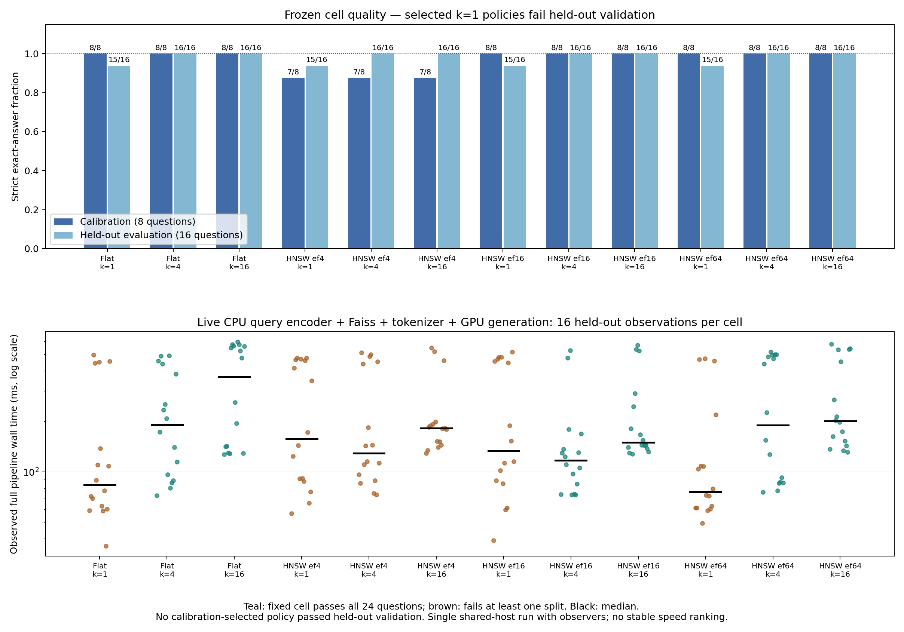
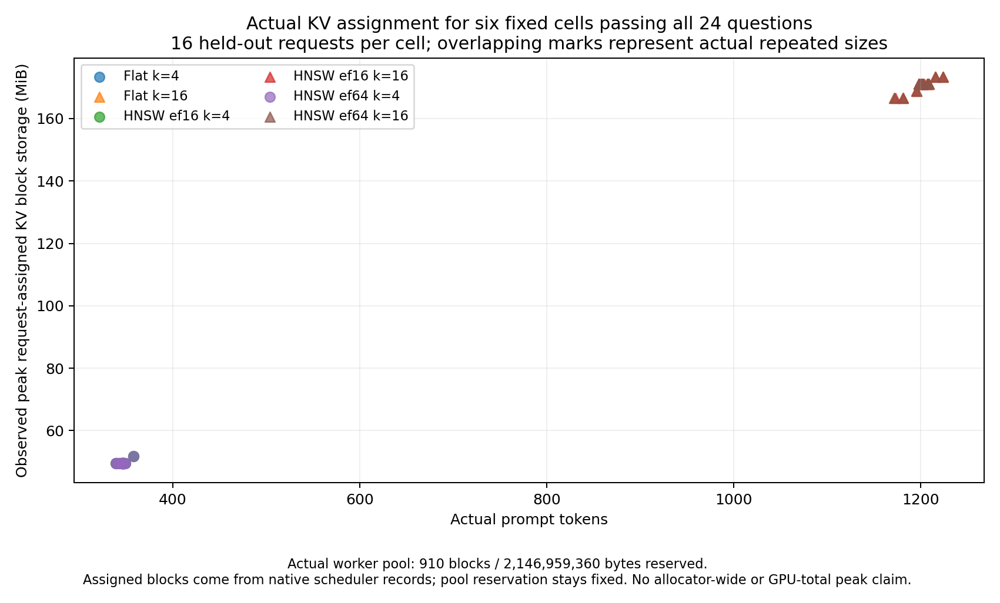

# 13-1 选做：真实检索与生成

已完成 CPU 编码、Faiss 检索及全部 288 个真实检索→生成请求。GPU 结果为 `runs/generation-001/`，独立评分与原生 KV/时序分析均已通过。本目录不替代 13-1 根目录的三候选设计评审，也不执行 `calculations/` 的容量与通信估算。

## 冻结任务与质量门槛

语料是 `freeze.py` 固定生成的 1024 个虚构 station register：站点名称及对应两词口令完全由脚本固定，明确属于自编事实测试集，不是自然问答 benchmark。固定 24 个问题，其中 8 个 calibration、16 个 held-out evaluation。检索输入不包含答案；生成上下文只包含实际检索到的文档。答案来自独立 `queries.json`，模型只能读上下文及问题。

运行前固定 `protocol.json`、语料、问题、encoder revision、12 个检索配置和质量门槛。FlatIP 的 k 为 1/4/16；HNSW M=8、efConstruction=40，efSearch 为 4/16/64，各自扫描 k=1/4/16。共 288 个生成请求，先 calibration 再 evaluation，split 内顺序用固定 seed 打乱。严格评分要求完整两词答案（仅去除首尾空白）及正常 stop，不做子串、大小写或模糊放宽。

每个检索配置族先用 calibration 选择最小合格 k，再看其 held-out 16/16 是否通过；若失败，保留失败，不能事后改选更大 k 冒充预选成功。所有预登记 cell 的完整结果也分别报告，只有 8/8 加 16/16 均通过的 cell 才具备固定样本上的共同质量资格。证据文档命中不是回答正确，精确向量近邻也不等于正确答案。

## 真实表示与索引

使用真实小型 pretrained encoder `sentence-transformers/all-MiniLM-L6-v2`，revision `1110a243fdf4706b3f48f1d95db1a4f5529b4d41`，384 维、attention-mask mean pooling，再作 FP32 L2 归一化。不是随机、hash 或模拟向量。实现遵循作者的 [Transformers 用法](https://huggingface.co/sentence-transformers/all-MiniLM-L6-v2)；所有输入长度显式检查不超过 256，不静默截断。

Faiss 1.12.0 的实际 `IndexFlatIP` 和 `IndexHNSWFlat(..., METRIC_INNER_PRODUCT)` 使用同一 FP32 向量。见 [Faiss 索引说明](https://github.com/facebookresearch/faiss/wiki/Faiss-indexes)。Flat 结果另用 FP64 全矩阵点积独立核对分数和 top-k 门槛，容许数值容差下的并列顺序。HNSW 保存实际序列化索引；其多线程建图不承诺跨平台逐位重建相同图。

CPU 正式结果 `retrieval-001/`：

| 指标 | 实测 |
|---|---:|
| encoder load | 1.691928 s |
| 1024 条文档编码 | 11.302180 s |
| 24 条问题批量编码 | 0.050709 s |
| Flat 构建 | 0.000216 s |
| HNSW 构建 | 0.023254 s |
| Flat 序列化文件 | 1572909 B |
| HNSW 序列化文件 | 1655730 B |
| 正式 search | 3168 次：12 配置 × 24 问题 × 11 次 |
| 编码/检索进程 ru_maxrss | 879360 KiB |
| 固定 Qwen3 实际输入 | 131–1227 token |

每配置一次预热不纳入正式计时，正式调用顺序预先打乱。空间是实际序列化文件字节，不是虚构的理论内存或进程 RSS。正式检索按问题独立调用；生成时另执行在线检索，不拿准备阶段 search time 与生成耗时简单相加冒充端到端。

检索证据命中数（分母 24，仅指检索证据指标）：Flat k1/4/16 为 23/24/24；HNSW ef4 为 22/23/23，ef16 和 ef64 均为 23/24/24。完整原始分数、IDs、时序和各 split 命中在 `searches.json`、`generation-plan.json`、`retrieval-summary.json`。

## 在线流水线接口

`serve_retrieval.py` 是持久 CPU 子进程，强制隐藏 CUDA。一次加载真实 encoder、两个 Faiss 索引及固定 Qwen3 tokenizer，然后按每个请求实际执行 query encoding、search、文档组织、chat template/tokenization。stdout 仅 JSONL，首先输出 ready 记录；输入 `{"id":"c00-q-00"}`，输出对应 prompt token IDs 与实测阶段时间；`{"stop":true}` 正常结束。

每个在线结果必须与冻结的检索文档和 prompt token IDs 完全一致，否则停止，不暗改候选。`cpu-service-check.json` 已实际通过全部 288 个请求，是独立 CPU 接口预检，不混入正式生成计时。`assembly_after_encoding_s` 包含 search，不能再次相加。本次生成执行器的外层实际墙钟覆盖在线检索请求及生成完成。

固定生成模型是已缓存 Qwen3-8B revision `b968826d9c46dd6066d109eabc6255188de91218`，no-thinking、greedy、max_tokens=32、单并发、无前缀缓存。GPU 执行器、native scheduler/KV 观测和资源监督由 root 维护。TTFT 不是纯 prefill；scheduled-token、block 和实际 KV storage 记录不能被解释为跨请求隔离的内核时长。缺失指标必须保留 null，不以容量公式代替实测。

## 实际生成、质量与 KV 结果

全部 288 请求正常返回；严格答案评分为 281/288。七个不合格响应均为 UNKNOWN，实际检索上下文缺失目标 station 文档；保留原始记录，不将这些科学负结果删成“失败重试”。这不是通用准确率，而是 12 个配置对固定 24 问题的完整扫描。

**预登记选择策略没有通过 held-out 验证。** Flat、HNSW ef16、HNSW ef64 都在 calibration 选择 k=1（8/8），但 held-out 都为 15/16；ef4 的任何 k 都只有 calibration 7/8，无法选出合格候选。没有用 evaluation 反向改选 k=4 并声称预选成功。

另一个严格分开的观察是：六个预登记固定 cell（Flat/ef16/ef64，各 k4/k16）均在 calibration 8/8、evaluation 16/16 上合格，可作这组固定样本的同质量描述。以下仅展示这六个 cell 的 held-out 实测，未将不合格候选混入速度推荐：

| 固定 cell | Held-out E2E 中位数 | 输入 token 中位数 | 实际每请求峰值 assigned KV（最大值） |
|---|---:|---:|---:|
| Flat k4 | 191.249 ms | 346.5 | 54263808 B |
| Flat k16 | 368.577 ms | 1201.5 | 181665792 B |
| HNSW ef16 k4 | 117.139 ms | 346.5 | 54263808 B |
| HNSW ef16 k16 | 149.898 ms | 1202.0 | 181665792 B |
| HNSW ef64 k4 | 190.284 ms | 346.5 | 54263808 B |
| HNSW ef64 k16 | 200.894 ms | 1201.5 | 181665792 B |

每 cell 的 held-out 只有 16 次请求，单次完整运行、共享主机且存在观测扰动。图保留所有请求和明显分散的时间，不把这些中位数当作稳定速度排名，也不声称较快 Faiss search 必然产生相同比例的 E2E 加速。





实际固定 worker KV pool 为 910 blocks、2146959360 字节；每个 block 的实际底层 storage 对应 2359296 字节。逐请求 assigned KV 来自原生 scheduler 的 block ID/refcount 记录并与 worker storage 关联，包含 block 分配粒度；不是按模型配置估出来的理论 token 字节。k4 的每请求最大占用 23 blocks，k16 为 77 blocks，而引擎保留的总 pool 在请求间没有因此缩小。全 288 请求实际 scheduled token 总数为 162740；逐请求核对为 input tokens + output tokens − 1（本次禁用 async scheduling），没有凭空补 prefill 内核时间。`pure_prefill_kernel_s` 保持 null，scheduled-to-first-token 仅是实际引擎事件区间。

执行器实际使用 vLLM 0.23、BF16 KV、固定约 2 GiB KV 预算、max length 4096、chunk256、eager、单序列、APC off、async scheduling off。推理、tokenization、检索及选择参数均固定，没有对七个 UNKNOWN 重试改题。

资源观察存在明确缺口：原 guard 只看继承自定义 token 的进程，漏掉 vLLM engine 后代。因此 raw GPU=0 不是真实 GPU 用量，tagged RSS 也不是整个任务 RSS，不能据此声称完整树的资源峰值或无存活后代。worker 自身的 CUDA allocator peak 为 18582745600 字节，仍不是 nvidia-smi 总显存峰。root 另有实际 EngineCore 退出日志、结束后 GPU 进程列表等证据。详见 [ROOT-RESOURCE-NOTE.md](ROOT-RESOURCE-NOTE.md)；`executed-source/` 保留本次真正执行、SHA 对应的旧 guard，BASE 修正仅供后续使用，不宣称已保护这次历史运行。

`data/records.json` 保存原始答案、在线检索与引擎指标；`quality.json` 保存独立 gold 对照及预选状态；`pipeline-analysis.json` 保存逐请求真实 E2E、scheduled tokens 与 assigned KV；`blocks.jsonl` 和 `kv-snapshots.json` 是原始块级证据。图同时提供 PNG/SVG 并绑定输入分析 SHA。

## 复现与文件

RTX 私有环境 `.venv` 只新增 Faiss CPU，通过只读 `.pth` 复用已有 SG 环境的 Torch/Transformers，不改共享 site-packages。实际版本在 `cpu-environment.json`。encoder 下载 91577950 字节，模型和依赖总新增低于 1 GiB。完整 encoder 权重保留在 RTX，本地仅保存配置、tokenizer、作者 README 与 SHA 清单；`download_encoder.py` 可下载同一固定 revision，并在加载前核验所有文件 SHA。

```sh
python -B download_encoder.py
python -B retrieve.py --out retrieval-002
python -B prepare_prompts.py --retrieval retrieval-002 --model /path/to/b968826d9c46dd6066d109eabc6255188de91218
python -B analyze_search.py --retrieval retrieval-002
```

只重放分析用 `retrieval-001/`。原 corpus/query/protocol 在 `preregistration.json` 绑定；不要重新执行 freeze 覆盖它们。`score_generation.py --prompts .../prepared-prompts.json --records .../records.json --out .../quality.json` 严格要求全部 288 个请求各一次，并独立读取 gold。保留真实科学负结果；被成功替代的启动调试文件不保留。
