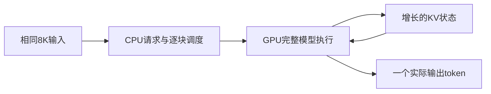
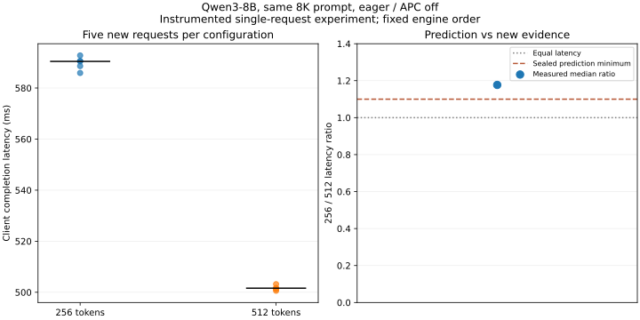

# 13-6：先封存判断，再用未见配置修订决定

本案例固定一项单请求任务，比较Qwen3-8B在256／512-token分块下的实际完成时间。**预测在新实验启动前封存**，已知的旧512记录明确披露；不是事后从结果倒写判断。原预测文件及SHA256保持不变。

## 任务、候选与边界

同一8192-token输入、相同Qwen3-8B revision `b968826d9c46dd6066d109eabc6255188de91218`、BF16、eager、APC关闭、单活跃请求、24GiB KV池，只强制输出1token。全部输入独立保存。质量约束是同输入和实际输出一致，不代表合成提示的自然任务正确率。

候选A为256预算，可能缩短每块占用，但增加执行次数；候选B为512预算，减少块数。第三候选为整段prefill，可能进一步减少提交，但其混合服务干扰需要另测，因此未进入本次最小实验。模型或硬件替换会同时改变更多条件，本次先验证软件预算这个可区分的未知量。



权重、输入、输出目标和KV容量固定，状态始终在同一GPU实例内；此次没有状态传输或其他并发请求。更少块数不等于全部工作按比例减少，历史注意力、形状效率和主机提交仍影响耗时。

## 事前判断与新增证据

prediction.json记录日期、已知证据、候选、未知量、选择与推翻标准：预测256的完成延迟中位数至少为512的1.10倍，暂选512；低于1.10拒绝定量判断，低于1反转测得的选择。此前8-2已测512逐历史位置时间，这点公开列为已知；本次256对512的新配对结果在封存时未读过。

分别启动两个引擎，顺序固定256后512，每个先热身1次，再执行5次。全部记录包含客户端时间、worker CUDA event、实际调度token及此前已调度历史。源码／配置／预测哈希随远端原始结果保存。

| 新测量 | 256预算 | 512预算 |
|---|---:|---:|
| 完成延迟中位数 | 590.437 ms | 501.604 ms |
| 每请求实际prefill块数 | 32 | 16 |
| 正式请求数 | 5 | 5 |

256／512中位数比值 **1.177**，达到封存的1.10最低预测值；10次输出全部为同一个token，输入相同。逐请求验证所有块的预算与历史累计，未用标称配置代替实际调度。结果支持本轮判断，保留单请求任务选择512的决定。



## 反例、未知量与修订条件

混合服务中，512块可能使其他decode请求等待更久；本次没有这类请求，不能由单请求结果宣布服务最佳预算。两组为固定引擎顺序、共享GPU、带worker观测，尚不能排除跨进程状态和观测开销影响；event区间也包含主机提交间隙，不是纯attention时间。部署前需要不加观测的交错轮次与同负载的ITL／SLO验证，若结果变化则修改选择。

本例补足“先封存—实测—修订”的完整证据链；第13章其余三份完整系统候选、投入条件和未来预测仍分别待交付。不是通过这一个局部实验宣布全书完成。未运行或修改calculations，C76的教学计算继续由另一任务负责；最终跨session增补复核尚未开始。

## 独立复现

```sh
python analyze.py
python plot.py
```

离线核验只需标准库，绘图需Matplotlib。真实执行需原始结果中记录的vLLM环境与同模型缓存，在本目录使用新输出目录：

```sh
/home/ubuntu/vllm023-venv/bin/python run.py --budget 256 --output results/new256
/home/ubuntu/vllm023-venv/bin/python run.py --budget 512 --output results/new512
```

程序拒绝覆盖已有结果。新结果分析在目录副本中改读取路径，原预测不更新；有新假设另存版本。两个引擎均正常退出，未停止原有服务。
