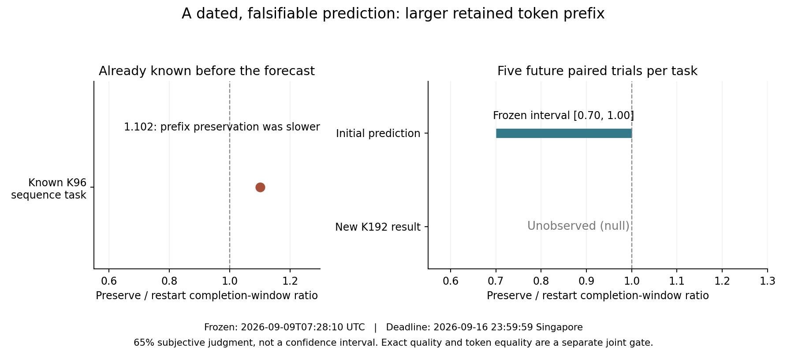

# 13-7：一项先冻结再复核的有条件预测

本实验在尚未执行的新K192抢占条件上，先冻结指标范围、截止日期、质量门槛和推翻规则，再运行实际对照。两个任务的答案与原K32／96结果已知；未知的是K192恢复后的联合正确性，以及五轮配对完整窗口之比。没有把既有输出重新命名为未来预测。

实际全批已完成，10个配对比值的中位数为 **0.693141**；区间门槛未通过，20条恢复路径的联合质量／token门槛通过。评判为`refuted_in_scope`。执行开始2026-09-09T07:30:02.180899+00:00、完成2026-09-09T07:38:44.859564+00:00，均与预测冻结时间分开登记。

数值区间未通过时，即使方向更有利，也不会改成预测成功；单个配对波动不与中位预测混为一谈。实际观察保存在[最新观察](observations/0001.json)，模型修订决定在[修订决定](revisions/0001.json)。应用事前规则：Record interval miss despite stronger direction; recalibrate a new prediction without altering v1。原区间、主观概率和null原件没有重写。

实际30路径、50个worker、20次抢占完成；19516项机制检查通过，30路径质量通过，30路径token与各自baseline一致。真实采样9420个token（含EOS），唯一提交7500个位置，重复投递1920次。总墙钟522.648秒，进程组RSS采样峰4,714,250,240 bytes。没有因不利墙钟剔除任何轮次，也没有启动失败需要清理。

| trial | task | restart秒 | preserve秒 | 配对比值 |
|---:|---|---:|---:|---:|
|0|sequence|11.795|9.037|0.766111|
|0|extract|15.436|9.840|0.637456|
|1|sequence|14.017|9.867|0.703958|
|1|extract|13.778|13.092|0.950270|
|2|sequence|31.614|29.631|0.937277|
|2|extract|47.176|17.619|0.373470|
|3|sequence|25.068|14.576|0.581439|
|3|extract|29.885|20.391|0.682323|
|4|sequence|22.069|14.418|0.653320|
|4|extract|23.196|16.800|0.724262|

## 原始预测与时间边界

[prediction.json](prediction.json)于 **2026-09-09T07:28:10.963322+00:00** 冻结；[prediction.sha256](prediction.sha256)绑定不可覆盖的原件，observation和revision仍为null。到期时间为 **2026-09-16 23:59:59（新加坡）**，即UTC15:59:59。到期是最迟复核时间，不要求等待到当天才能新增证据。

在相同Mac M2 Max、固定Qwen3-8B-MLX-4bit、两项原11-4任务、不thinking／greedy及相同同步事务runner下，把抢占阈值改为192个非EOS token。每任务5个配对trial，主指标R为10个`preserve窗口/restart窗口`比值的中位数，预测 **0.70≤R≤1.00**。另要求20条恢复路径全部自然EOS、严格JSON合格且完整token IDs与本trial baseline相同，两项联合通过才支持预测。

主观把握65%，不是统计置信区间、经验成功率或已校准概率。单次预测命中也不能证明65%已校准。R小于0.70同样记数值区间失准，不能因方向更好就追改区间；质量或token门槛失败也会推翻联合判断。



这张初始图在实际运行前生成并单独绑定[图SHA](freeze-view-sha.json)，明确显示Unobserved(null)，之后不覆盖。更新图[当前预测与实际观察](prediction-current.png)使用新增观察文件，缺失数据不填0或画预期成功曲线。

## 最有力的已知反例与预测理由

已封存的11-4 sequence／K96中，保留前缀窗口12.800秒，从头重做11.619秒，实际比值 **1.101664**；省去了重复采样，却没有更快。完整历史摘要冻结在[known-evidence/11-4-summary.json](known-evidence/11-4-summary.json)，来源SHA列入原预测，和K192新观察分开。

提出更大K下的速度范围，是因为可避免的串行decode增多；这只是有条件判断，并未假定加载、第二次prefill、KV重建、逐tokenSQLite确认或主机共存开销为零。上述K96反例正是预测可能失败的理由。新K192各配对窗口也有明显波动，例如不同trial的restart窗口并不恒定；未单独控制CPU共存、加载和事务调度，不能把比值差异全部归因于KV重建。不能在看到新数据后删除这个反例。

## 固定对照与冷暖条件

[PROTOCOL.md](PROTOCOL.md)和[future-plan.json](future-plan.json)固定30条路径：5trial×2任务×3策略。每trial的6路径用seed1307连续随机流打乱；不选最佳轮次，不提前停在有利结果，配对只在同task、同trial内进行。任务文本与严格期望未改，baseline是实际重复，不能当30个独立任务。

原prompt按256token分块；preserve已提交前缀按64token分块实际重建。K192是3个64块，仍支付模型工作。采用已有热文件缓存和前序smoke状态，不清缓存，不另暖模型，每个worker重新加载权重。Mac可与CPU小任务共存，不作独占因果、标准mlx-lm吞吐或生产加速结论。

一次只运行一个实际Metal worker，RSS／MLX active限制16GiB；不下载或复制权重。小型runner源码复制到本目录，原11-4保持不变。全部模型调用、token、提交、数据库快照、抢占、资源与进程时间来自新实际执行；原模型身份和执行源文件SHA在冻结预测中绑定。新执行的provenance.json要求开始时间晚于预测冻结，并记录完成UTC，不能拼接历史monotonic时钟。

## 推翻、修订与缺失记录

- 质量或token失败：撤回无条件恢复等价判断，先检查批量prefill算术路径，再冻结新的正确性对照。
- R>1：拒绝当前速度预期，把模型加载、KV重建、decode及事务／主机等待分开修订。
- R<0.70：记录区间失准，方向虽更有利，也须新版本重新预测。
- 联合门槛通过：只保留本硬件、模型、任务和runner条件，不外推随机采样、其他模型或生产环境。
- 截止仍无完整30路径：状态为expired_unobserved，数值仍null；部分结果不能从分母剔除后充当完整验证。超期数据标late，不追认按期命中。

修订使用单独版本文件，绝不覆盖v1。新增观察依据实际raw和分析结果，事件追加到events.jsonl，包含前一事件摘要与新文件SHA。外部工具或人工改动仍可能篡改本地文件，所以这不是可信时间戳服务；它提供可复核的本地顺序、内容绑定和不可静默覆盖约束。

## 复核与持续更新

不加载模型查看当前状态或截止后的状态：

```sh
python ledger.py status
python ledger.py status --as-of 2026-09-17T00:00:00+00:00
```

`--as-of`仅解释已有记录，不生成未来结果。已有实际记录可在副本离线重算；分析仅加载tokenizer，不加载模型：

```sh
python analyze_run.py --name formal
python ledger.py status
python plot.py
python write_report.py
```

新批次已完整执行并通过离线分析后，用`python ledger.py record --run completed-new-run`登记；已登记批次不再次record。record只接受完整冻结计划的实际结果，拒绝再次登记相同summary；检验预测SHA、执行时间、机制检查和30条身份，再计算10配对比值。新观察及修订追加版本文件，原prediction.json和初始图不能覆盖。第一次模型执行使用`execute_prediction.py --name formal --execute`；已有正式输出禁止覆盖，复核无需重新生成。本书原题来源为第13章13.5.2的日期、反例、观察、修订要求，未修改正文或inventory。

所需证据均为本书已封存及本轮真实本地结果，没有借助未核实的新论文结论。不执行C76/C63计算、成本或资源存活模型，不修改calculations，不开展最终跨session论文审计。全部交付文件最终由manifest封存。
