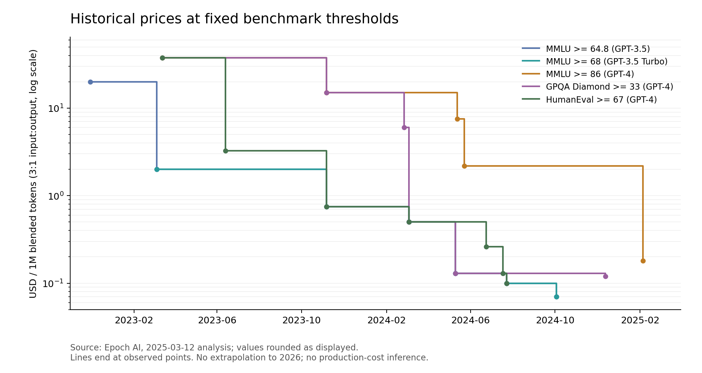

# 2023—2026 年固定能力下的 token 成本下降：模型、芯片与推理系统的共同作用

调研截止：2026-09-07。本文是供《深入理解 AI Infra》后续写作使用的独立研究报告。大纲只放置简短占位，具体位置见[章节落点](outline-placement.md)。一手论文、官方模型卡、工程公告、PR 元数据与公开测量的本地原件见[资料与阅读索引](../../references/token-cost/2026-09-07/README.md)；数值复算见[计算记录](calculations.json)。

<a id="findings"></a>

## 1. 调研结论

作者提出的线索成立：理解这三年 AI Infra 的变化，不能只看最大的模型需要多少卡，还应看**完成既定能力要求所需的资源如何减少**。模型训练得更充分、结构更适合推理，配合低精度硬件、内核、请求调度和资源共享，使同一类能力逐步进入更便宜的服务与更小的设备。这条线可以贯穿全书。

但是，“2023—2026 年同等智能的 token 成本统一下降约 1000 倍”还不是本次证据能够证明的统计结论。公开材料里的倍率对应不同问题：固定评测门槛的 API 价格、固定模型的吞吐、某种延迟要求下的系统成本，以及完成一道题的实际费用。时间窗口也不相同。不能把这些数拼接成一个行业总倍率。

本次核查得到五点明确结论：

1. **数量级下降有公开证据，幅度依赖起点与门槛。** Stanford AI Index 2025 的典型例子是从 2022 年 11 月到 2024 年 10 月，达到 GPT-3.5 的 MMLU 门槛，价格从每百万 token 20 美元降至约 0.07 美元，约 286 倍。改从 2023 年 GPT-3.5 Turbo 的 2 美元起算，同一终点约为 29 倍。两种写法不能互换。[Stanford 2025][ai-index-2025]、[Epoch 的原始价格分析][epoch-prices]。
2. **“小模型赶上旧大模型”是能力密度提高的观察，不能直接变成通用等式。** 必须说明模型版本、base 或 instruct、评测项目与思考预算。参数减少通常降低权重容量和矩阵工作量，但不能独自证明任务质量不变。[Llama 3 模型卡][llama3-card]、[Densing Law][densing-law]。
3. **vLLM 的记忆基本准确，归因需要修正。** 2024-09-05 的 v0.6.0 公告报告，相比 v0.5.3，Llama 3 8B 吞吐提高 2.7 倍、70B 提高 1.8 倍。API server 与引擎分进程，缓解 GIL 竞争，是其中一项；多步调度、异步输出和对象管理等共同形成了这次版本收益。[vLLM 公告][vllm-060]。
4. **芯片代际进步不能概括为摩尔定律。** 工艺之外，Tensor Core 支持的数值格式、HBM 容量与带宽、封装、NVLink、软件成熟度和部署拓扑都会改变有效产出。2026 年出现的几十倍系统宣传数，不能直接用作同精度、同规模的单芯片进步。[Blackwell 架构原件][nvidia-blackwell-brief]、[NVIDIA 的 InferenceX 引用][blackwell-inferencex]。
5. **MTP 有两个收益位置。** 训练时可改善学习；推理时可为推测解码提供草稿，减少目标模型串行往返。两者应分别记账。更便宜的 token 也可能被更长的思考、更多重试与工具循环抵消，因此最后要回到成功任务的成本。[Meta MTP][mtp-meta]、[DeepSeek-V3][deepseek-v3]、[The Price of Progress][price-progress]。

建议全书采用的主论点是：**2023 年以来，固定能力门槛的获取价格出现了数十倍至数百倍的可核实下降；千倍可以是特定起止点或情景的待检验命题。下降来自模型与整套执行系统共同减少工作、加快工作和提高资源利用率。** 第一章提出这个问题，后续章节逐项解释，终章再讨论它们怎样相互影响。

<a id="measurement"></a>

## 2. 首先明确：什么叫“同等智能下的 token 成本”

### 2.1 三种成本与一个价格前沿

| 对象 | 分子与分母 | 能回答的问题 | 容易发生的误用 |
|---|---|---|---|
| API 单价 | 服务商对输入、输出、缓存等分别报出的价格 | 用户按这份价格表会付多少钱 | 把售价当成服务商生产成本 |
| 固定模型的生产成本 | 一个计量区间的完整服务费用／该区间的有效产出 | 系统改动是否减少资源消耗 | 用最高离线吞吐代替实际在线产出 |
| 固定能力的最低价格 | 在满足质量与服务要求的模型中选择最便宜者 | 某种已有能力是否更容易获得 | 把一个评测分数称作全部智能 |
| 成功任务成本 | 全部尝试的模型、工具与环境费用／成功任务数 | 业务得到一个合格结果要付多少钱 | 忽略隐藏思考、失败和重试 |

若输入、输出比例固定为 3:1，每百万混合 token 的价格为：

`p_mix = (3 × p_in + p_out) / 4`。

这是一种统计权重，不表示输入和输出需要同样的硬件工作。实际一项请求的 API 账单应由各类真实用量分别计算；reasoning 已计入输出 usage 时不能再加一次。缓存写入、读取、存储以及 batch 折扣也必须与其适用条件一起记录。

固定能力的价格前沿可以写为：

`P*(q, w, s, t) = min p(m, provider, t)`，约束为 `Q(m, w) ≥ q` 且服务满足 `s`。

其中 `q` 是能力要求，`w` 是任务与请求分布，`s` 是延迟、可用性和上下文要求。真实业务的 `q` 通常是一个向量：代码正确率、工具调用成功率、中文理解、长上下文检索等，不能默认可压成一个分数。公开历史分析往往只固定其中一个 benchmark；其结论的范围也应相应缩小。

### 2.2 服务商成本的分母尤其关键

取同一计量区间，设完整服务费用为 `K`，满足要求的输出 token 数为 `Y_good`：

`c_out = K / Y_good`。

`K` 可以来自完整云账单，也可以来自自有设备的折旧、资金、供电、散热、CPU、内存、网络、运维等归集。用云租赁费用时，不要再重复加入租赁已经覆盖的设备折旧或电力。将输入处理费用分摊到输出 token 是一种核算选择，必须声明；若分母改成输入加输出，数值不能再直接与输出价格比较。

对全年运营，`Y_good` 应包含低谷闲置、预热、故障与排队造成的实际影响。若采用实测平均吞吐，不能再额外乘一个已经计入测量的利用率。SLO 下的 goodput、最大吞吐与单用户 token/s 是不同指标。DistServe 的研究正是把阶段分离放在 TTFT 与 TPOT 约束中衡量，而非只最大化总 token/s。[DistServe][distserve]。

### 2.3 保持“等价”所需的记录

每个比较至少保存：模型与修订、权重格式、任务集与评分、提示模板、采样与 reasoning 设置、真实输入输出长度、缓存状态、batch／并发、TTFT／TPOT 门槛、硬件数量与形态、引擎版本、时间范围、成本边界。不能要求所有研究都完整披露这些量，但缺失的项必须限制相应结论。

尤其注意四个变化：不同 tokenizer 对同一段文字的 token 数不同；思考会改变输出长度；评测饱和与训练污染会削弱分数解释力；模型切换可能改善平均分却损害罕见知识、长文检索或工具可靠性。因此，书中宜用“达到某个已固定的能力门槛”作为可操作定义。

<a id="price-evidence"></a>

## 3. 价格到底下降了多少：可核实的时间线

### 3.1 先修正 280 倍的起点

下表由 Epoch 网页的固定门槛表提取；价格保留网页显示的两位小数，因此倍率只是近似值。`Release Date` 是该表的数据字段，个别行反映价格更新，不应全部解释成模型首次发布日。复算脚本保留该表原值，不用今天的价格倒填历史。

| 能力门槛 | 起点 | 终点 | 每百万混合 token 价格 | 端点倍率 |
|---|---|---|---|---:|
| MMLU ≥64.8，GPT-3.5 门槛 | 2022-11-30，GPT-3.5 | 2024-10-03，Gemini 1.5 Flash-8B | $20 → $0.07 | 约 286× |
| MMLU ≥68，GPT-3.5 Turbo 门槛 | 2023-03-06，GPT-3.5 Turbo | 同上 | $2 → $0.07 | 约 29× |
| MMLU ≥86，GPT-4-0314 门槛 | 2023-03-14，GPT-4 | 2025-02-05，Gemini 2.0 Flash | $37.50 → $0.18 | 约 208× |
| GPQA Diamond ≥33，GPT-4-0314 门槛 | 2023-03-14，GPT-4 | 2024-12-13，Phi 4 | $37.50 → $0.12 | 约 313× |
| HumanEval ≥67，GPT-4-0314 门槛 | 2023-03-14，GPT-4 | 2024-07-23，Llama 3.1 Instruct 8B | $37.50 → $0.10 | 375× |

来源：[Epoch 的固定门槛历史表及方法][epoch-prices]。这些数是所采集服务价格的变化，不能单独推出底层需要的 FLOPs 或 GPU 小时减少了多少。



图中各线代表不同门槛，纵轴使用对数刻度；不会把 2025 年以前的观测延长到 2026 年。完整提取值见[历史价格数据](data/epoch-frontiers.csv)。这是公开数据重绘，不是本书实测。

### 3.2 为什么研究会给出很不一样的速度

Epoch 2025 使用六类 benchmark，跟踪达到既有门槛的最低价格；输入输出按 3:1 加权，有第一方 API 时用第一方价格，否则使用服务商价格的中位数，并排除 reasoning 模型。其拟合下降速度跨门槛差异很大；最快的短窗口不适合作长期外推。[Epoch 方法][epoch-prices]。

另一个直接相关的研究是 2025 年 11 月的 *The Price of Progress*。它研究 2024 年 4 月至 2025 年 11 月，在固定评测表现下，**跑 benchmark 的费用**大约每年降低 5—10 倍；对开放权重样本再扣除硬件价格进步，估计算法效率约每年提高 3 倍。这是带假设的统计分解，并非逐项测量了模型、内核和调度的因果贡献；它也解释了为什么计入 reasoning token 后，下降速度会与只比较 token 单价不同。[论文 §2—4][price-progress]。

这两项研究不应被写成谁推翻了谁。它们的时间窗口、样本、质量控制和费用分母都不同。若把 10 倍／年的趋势机械延长三年，算术上会得到 1000 倍，但这个运算只是外推，不是已经覆盖 2023—2026 的观测。

### 3.3 2026 年的补充证据与截止边界

本次同时归档并检查了 [AI Index 2026][ai-index-2026] 的相关技术表现与硬件部分；没有用“报告年份为 2026”将其中不同截止时间的数据冒充成截至 9 月的完整价格序列。新增的 2026 年证据采用明确事件：模型发布、系统工程公告以及带模型、长度、配置和测量日期的测试。

| 2026 年材料 | 可核实内容 | 能支持什么 |
|---|---|---|
| 3 月 Gemini 3.1 Flash-Lite 发布 | 公告价格为输入 $0.25、输出 $1.50／百万 token，并提供 thinking 控制 | 产品把质量、速度和思考预算联合设计 |
| 7 月 Gemini 3.5 Flash-Lite 发布 | 公告价格为输入 $0.30、输出 $2.50／百万 token | 新一代能力提高时，产品自身标价可以上升；不是固定门槛价格前沿 |
| 5 月 InferenceX，GB200／GB300 上的 V4-Pro | 相同模型、FP4、8K／1K 请求，调整 PD 与并行配置 | 硬件容量改变可用的服务配置，收益超过单项规格比 |
| 6 月 InferenceX，V4 上线后 43 天 | 追踪不同引擎和硬件从初始支持到优化后的变化 | 新模型上线早期的软件成熟度是巨大变量 |
| 4—8 月 SGLang、5 月 EAGLE 3.1、6 月 Ollama MTP | 稀疏缓存、统一状态复用、图执行与草稿路径的具体实现 | 2026 年的进步继续发生在状态与执行组织中 |

来源：[Gemini 3.1][gemini31-lite]、[Gemini 3.5][gemini35-lite]、[InferenceX GB300][inferencex-gb300]、[InferenceX V4 演进][inferencex-v4-evolution]、[HiSparse][sglang-hisparse-2026]、[统一缓存][sglang-unified-cache-2026]、[EAGLE 3.1][eagle31]、[Ollama MTP][ollama-mtp-2026]。

按 3:1 加权，两个 Flash-Lite 公告分别为 $0.5625 和 $0.85／百万混合 token。后者约高 51%，不能因为都叫 Flash-Lite 就把它们当同等能力的两次报价。反过来，也不能据此说固定能力的最低价格上涨：那需要同时检查当时仍可购买的其他模型。

本报告没有构造“所有提供商、所有能力、2026-09-07 当天最低价”的完整普查，也没有获得各模型商的内部生产账本。因此，对**统一的千倍总数及其因果贡献百分比不作确定判断**；对机制、代表证据、数量级和适用条件给出完整分析。

<a id="density"></a>

## 4. 模型能力密度：用更少参数达到已有能力

### 4.1 dense scaling、densing 与模型压缩

作者口述中的 dense scaling，在本报告中按“能力密度提高”理解。正式写作建议使用“能力密度提升（densing）”，避免与扩大稠密模型的参数规模混淆。这不必意味着把一个已有 70B 模型物理压缩成 8B；也可以是从头训练一个更小、但训练数据与配方更好的模型。

*Densing Law of LLMs* 将目标模型在参照模型族中达到同等评测表现所需的“等效参数量”，除以自身实际参数量，定义为能力密度。论文在 29 个开放 base 模型、五类 benchmark 上拟合到约 3.3 个月翻倍的上沿趋势。这个结果依赖参照模型和评测，属于经验观察；它不是所有智能每季度都能无损减半的定律，也不能直接外推三年。[Densing Law §1—3][densing-law]。

关于陆奇与作者的交流，只能保留“作者提供的研究线索”这一来源状态。没有独立公开原文就不编造逐字引语，也不将一篇后来查到的论文反推为那次交流的具体依据。

### 4.2 “8B 相当于旧 70B”应怎样举例

Meta 的 Llama 3 模型卡在同一张 base 模型表中给出如下对照：

| 评测 | Llama 3 8B | Llama 2 70B | 该表支持的观察 |
|---|---:|---:|---|
| MMLU，5-shot | 66.6 | 69.7 | 小模型接近旧大模型，仍有差距 |
| BBH，3-shot CoT | 61.1 | 65.7 | 相近，但不是全面等效 |
| TriviaQA-Wiki，5-shot | 78.5 | 87.5 | 知识回忆的差距更大 |

同一模型卡的 instruct 表又呈现另一种比较结果。这说明后训练和提示条件本身会改变“追上”的含义。上述表格适合解释作者的直觉，也同时提醒读者按能力维度比较。[Meta 原表][llama3-card]。

Gemma 2 的小模型训练提供了机制证据：2B／9B 使用教师分布蒸馏，论文给出与从头训练的消融；其 9B 在 MMLU 取得 71.3。这个值可用于展示小模型进步，但跨厂商表格中的模板与评测实现未必一致，不应据此把所有旧 70B 的行为都判为已被替代。[Gemma 2 §3、§5、表 13][gemma2]。

Qwen3 公告提供更激进的小模型与旧模型对照，但同时引入 thinking／non-thinking 模式。引用这类结果时，要把思考预算作为额外计算投入；不能只除参数量，便声称完成任务的成本下降了相同比例。[Qwen3 发布说明][qwen3-launch]、[技术报告][qwen3]。

### 4.3 能力密度为何提高

| 机制 | 改变了什么 | 成本在哪里支付 | 如何验证 |
|---|---|---|---|
| 更长的预训练 | 相同参数吸收更多训练信号 | 训练计算与数据处理 | 固定参数、评测协议，比较训练 token 增长后的收益 |
| 数据筛选、去重与配比 | 降低低价值样本比例，改善代码、数学、多语言等覆盖 | 数据建设、筛选模型与训练 | 数据消融；不能仅由总 token 量推因果 |
| 蒸馏与合成数据 | 让小模型学习教师的概率、答案或解题过程 | 教师推理、筛选与学生训练 | 同预算的学生基线、质量和生成长度 |
| SFT、偏好优化与 RL | 改变如何使用既有知识、遵循要求和解决任务 | 标注、rollout、奖励与训练 | 相同任务的成功率、拒答和推理预算 |
| 推理预算控制 | 把额外计算用在更难的请求 | 每次调用的思考 token | 质量—费用曲线，而非一个最高分 |

Llama 3 的训练报告、Gemma 2 的蒸馏实验和 DeepSeek-R1 的蒸馏结果分别支持其中不同路径；它们不能提供一个可相加的行业份额表。[Llama 3][llama3]、[Gemma 2][gemma2]、[DeepSeek-R1][deepseek-r1]。

更长训练换更便宜服务还有明确的生命周期解释。Chinchilla 的训练计算最优点，并不自动等于训练加推理的总费用最优点。*Beyond Chinchilla-Optimal* 把预期推理需求纳入优化，得到推理量较大时采用更小模型、训练更久的动机。它的实验范围与外推误差需要随结论保留。[ICML 2024 正式论文][beyond-chinchilla-icml24]。

### 4.4 参数压缩怎样传到系统

对主要由稠密权重矩阵构成的低并发 decode，可以先用 `F ≈ 2P` 估算每 token 的参数矩阵计算，用 `P × b` 估算读取一次权重的字节数。70B 到 8B 的参数比是 8.75；只有相同质量、相近算子效率、权重读取占主导等条件满足时，才有相应的资源下降机会。

真正的系统收益还可能是离散的：模型从多卡变成单卡，少了分片通信；空出的显存可容纳更多 KV；同一机群能放更多副本，排队与故障影响也改变。也可能收益低于参数比：小矩阵利用率下降，CPU 提交开销变得显著，或者长上下文注意力取代权重读取成为主要负担。第 5 节继续区分这些工作量。

<a id="architecture"></a>

## 5. 模型架构：分别减少计算、状态和数据访问

### 5.1 MoE：活跃参数少，不表示所有参数都消失

MoE 用路由让每个 token 只通过部分专家。在相近能力下，它可能减少每 token 的 FFN 计算；但总专家权重仍需要驻留在 GPU、主存或其他存储中。多卡专家并行还产生 dispatch／combine 通信、负载不均衡和更复杂的调度。不能把总参数／活跃参数之比直接当成端到端成本倍率。

DeepSeek-V3 的 671B 总参数、37B 活跃参数说明了这种差别：37B 描述每 token 活跃的模型规模，671B 仍影响放置和容量。其实际服务还依赖专家划分、批处理、通信重叠及 FP8；应将模型结构与生产系统共同阅读。[DeepSeek-V3][deepseek-v3]、[DeepSeek 推理系统报告][deepseek-infra]。

稀疏专家也不等于 NVIDIA Tensor Core 的 2:4 结构化稀疏。两者省下的工作、支持条件和规格倍数不同，不能重复套用。

### 5.2 GQA／MQA：减少每个历史 token 的 KV

普通全注意力的 KV 容量可近似写为：

`M_KV = 2 × layers × length × kv_heads × head_dim × bytes × batch`。

前面的 2 来自 K 和 V。一个教学例子：32 层、32 个 KV 头、head_dim=128、BF16、8192 token、batch=1，需要 4 GiB KV；若改为 8 个 KV 头，变成 1 GiB。这个 4 倍只属于这一项 KV 容量，不是权重、全部访问或请求时延的 4 倍。GQA 必须在训练或适配中保持质量，不能任意把头删掉。[GQA][gqa]。

### 5.3 MLA 与更激进的状态结构

MLA 通过较小潜变量保存历史状态，并通过相应投影和执行方式计算注意力。DeepSeek-V2 报告相对 DeepSeek 67B 的 KV 减少 93.3%、最大生成吞吐提高至 5.76 倍。前者对应约 14.9 倍的 KV 压缩，后者属于整模型与系统的测量，已经不是单一 MLA 的独立倍率；更不能相乘。[DeepSeek-V2 摘要、§2、§4][deepseek-v2]。

2025—2026 年的稀疏注意力、压缩注意力和线性／递推状态继续减少长上下文访问，但要分别问：历史信息被怎样保存、一次 decode 访问哪些位置、索引需要多少工作、哪些任务可能受影响。V3.2 的 DSA 与 V4 的 CSA／HCA 不是同一个机制。[DeepSeek-V3.2][deepseek-v32]、[DeepSeek-V4][deepseek-v4]。

V4 报告中的醒目例子是在 **1M token 上下文**下，V4-Pro 单 token 推理 FLOPs 约为 V3.2 的 27%，KV 约为 10%。这是特定上下文的模型资源比较；不能写成所有短请求便宜 10 倍，也不能从这两个比例直接推出美元成本。报告中的模型版本和长上下文条件应随引用保留。[V4 图 1 及相应说明][deepseek-v4]。

2025 年的 Kimi Linear 提供了混合递推状态的具体例子：KDA 以有限状态承接序列信息，并与 attention 层组合。递推部分每层状态相对于序列长度有界，混合中的全局注意力仍需单独核算；不能把整个模型都视为常数大小的缓存。实际效率还取决于分块执行、状态精度和内核，质量则需要短文、长文与推理任务的对照。[Kimi Linear 技术报告][kimi-linear]。

### 5.4 架构变化的统一解释

| 改动 | 首先减少的资源 | 可能新增的代价 |
|---|---|---|
| 更小的稠密模型 | 权重容量、参数矩阵计算与读取 | 训练投入、某些能力损失、小矩阵低利用率 |
| MoE | 每 token 活跃 FFN 计算 | 总权重容量、通信、路由与不均衡 |
| GQA／MQA | KV 头数与历史状态流量 | 质量约束、算子实现差异 |
| MLA | KV 表示大小 | 投影、不同阶段的执行路径与内核适配 |
| 稀疏／窗口注意力 | 访问的历史位置或范围 | 索引、选择、长距离任务质量 |
| 混合递推状态 | 部分层随上下文增长的状态和读取 | 状态回滚、前缀复用、检索能力与训练变化 |
| MTP | 后文推测解码中的串行目标模型调用 | 额外预测模块与验证工作 |

这些资源变化共同解释为什么“同样大的模型”和“同等能力的模型”都可能在变便宜。但二者分别回答结构效率与能力效率的问题，不宜混成一个参数缩小系数。

<a id="hardware"></a>

## 6. 芯片与整机：摩尔定律只是其中一部分

### 6.1 把代际变化拆成几种物理能力

2023 年的服务主要面对 A100 与逐渐普及的 H100；随后 H200、Blackwell 和 Blackwell Ultra 改变了容量、带宽和低精度计算条件。芯片发布年份、实际部署年份、论文测量年份应分别记录。A100 虽早于研究窗口发布，仍是 2023 年的合理部署参照。

| 固定形态／来源时点 | 每 GPU HBM 容量 | 标称 HBM 带宽 | 在推理中首先影响什么 |
|---|---:|---:|---|
| A100 80GB SXM，官方数据表 | 80 GB | 2.039 TB/s | 权重与 KV 的驻留、供数 |
| H100 SXM，官方规格快照 | 80 GB | 3.35 TB/s | 同容量下更快供数；FP8 等执行能力另算 |
| H200 SXM，官方规格快照 | 141 GB | 4.8 TB/s | 更多并发状态或更大模型，减少放置限制 |
| GB200 NVL72，2026 年 InferenceX 配置表 | 192 GB | 8 TB/s | 机柜内放置、批处理与更大专家并行 |
| GB300 NVL72，同上 | 288 GB | 8 TB/s | 在带宽相同情况下，用容量支持更多状态与不同配置 |

来源：[A100][nvidia-a100-80-spec]、[H100][nvidia-h100-spec]、[H200][nvidia-h200-systems]、[InferenceX 2026 规格与部署表][inferencex-gb300]。最后两行采用该测量的 NVL72 形态，不套给所有 B200／B300 产品。较早的 Blackwell 产品简介还有不同频点与“up to”规格，不能在计算中随意替换。[Blackwell 简介][nvidia-blackwell-brief]。

由这些输入，A100 到 H100 的标称 HBM 带宽约提高 1.64 倍，H100 到 H200 约提高 1.43 倍。它们足以产生明显收益，但已经说明：固定模型的带宽受限 decode，不会因为某个低精度算力宣传提高几十倍，就自然得到相同吞吐增幅。

芯片的另一条线是计算单元与数值格式：矩阵专用单元、FP8／FP4、缩放粒度、累加精度和异步数据通路。Blackwell 使用 2080 亿晶体管和 TSMC 4NP，采用双芯粒等设计；这些变化既涉及工艺，也涉及芯片规模、封装和架构，不能都算成相同面积下的制程红利。[Blackwell 架构原件][nvidia-blackwell-brief]。

### 6.2 硬件峰值怎样变成有效 token

可以把一段执行时间写成必要资源下界与实现开销的组合：

`t ≥ max(F / F_hw, V_HBM / B_HBM, V_link / B_link, dependency_path)`。

该式只表达必要下界。阶段不能重叠时，要沿依赖相加；多个工作争用同一存储或互联时，也不能各自假设独占峰值。提升计算峰值能否变成吞吐，取决于模型是否计算受限、矩阵够不够大、内核是否支持该精度，以及 GPU 是否持续得到任务。

容量则常常是阶跃条件。多几十 GB HBM 不只是让一个数变大，可能让一套原来完全不可行的 batch、KV 或专家放置方案可行。这类间接收益属于软硬件共同作用，不能再把“容量收益”和“批处理收益”当成互不相关的两个因子。

### 6.3 用 2026 年的公开系统比较看这种协同

InferenceX 的 GB200／GB300 对照固定 V4-Pro、FP4、输入 8192／输出 1024，双方均采用 Dynamo＋vLLM 的 PD 分离，不使用推测解码。它给出 2026-05-22 的测量日期与 GitHub Actions run，并在不同交互速度下比较每 GPU 吞吐。中段差距大于简单规格比，与更大的 HBM 容量允许不同服务配置有关。[公开测试与原表][inferencex-gb300]。

复算时需要特别认真：该文在约 27 token/s/user 处列出 6182 对 2189 token/s/GPU，并采用 $2.65 对 $2.21／GPU-hour 的 TCO 假设；从这些显示数字计算，吞吐比约 2.82，成本比约 2.36。正文另报 2.31 的成本比，不能由上述取整值精确复现。本报告保留“约 2.3 倍”的量级和这一差异，不补造插值数据。

这也提醒我们，公开测量的吞吐与公开模型估计的 TCO 属于不同证据。每 GPU 归一化不意味着两边使用了相同数量的 GPU；cost per million total tokens 也不等于 API 输出 token 单价。这里没有取得与该文章所有插值点完全匹配的运行日志，因而不声称复现了它的完整前沿。

NVIDIA 的另一篇 2026 年文章引用 Blackwell Ultra 对 Hopper 在低延迟区间最多 35 倍的 token 成本差异，并说明软件优化参与其中。这类结果适合作系统协同的案例，不能写作“Blackwell 单芯片比 Hopper 便宜 35 倍”。Rubin 的预期收益则保留发布或预测状态；本报告不把产品目标加入已实测的 2023—2026 总降幅。[NVIDIA 2026 公告][blackwell-inferencex]、[Rubin 架构说明][nvidia-rubin-arch]。

### 6.4 不只 NVIDIA，以及摩尔定律的边界

AMD、昇腾、TPU 和端侧处理器分别提供不同的容量、计算、互联与部署条件。要分析它们对成本下降的贡献，应比较同任务、同质量下实际可用的执行栈，而不是把不同精度 TOPS 拼成排名。AMD MI350X 的大容量与低精度支持是可查的规格；V4 在不同芯片上的初期支持差异，则反映软件适配会显著影响可用性能。[AMD 官方规格][amd-mi350x]、[InferenceX 跨平台演进][inferencex-v4-evolution]。本书已有的[硬件覆盖笔记](../../references/HARDWARE-COVERAGE.md)保留其他平台原件，本报告不据此编造各厂商推动行业价格下降的份额。

即使使用“每两年晶体管数翻倍”作为教学假设，三年也只是约 2.83 倍，且晶体管数还不等于可用带宽、同质量 token/s 或成本。HBM、封装、更多芯片、专用计算、低精度与软件共同改变性能；摩尔定律不能独自解释所观察到的价格数量级变化。

<a id="quantization"></a>

## 7. 低精度与内核：既少搬数据，也改变执行方式

### 7.1 量化首先改变哪些资源

仅计权重有效载荷，BF16 到 INT8／FP8 将每参数字节数从 2 降到 1，4 bit 再降到 0.5。实际容量还要加缩放因子、zero point、分组填充、非量化层和运行时工作区。权重量化与激活量化、KV 量化也必须分开。

| 量化路径 | 代表工作 | 常见收益位置 | 主要限制 |
|---|---|---|---|
| 权重低比特，计算仍用较高精度 | GPTQ、AWQ | 权重驻留、低并发 decode 的读取 | 解量化、内核形状；算力不一定提高 |
| 权重与激活同时低精度 | SmoothQuant 等 | 大矩阵计算与搬运 | 激活异常值、校准、累加误差与硬件支持 |
| FP8／FP4 原生矩阵路径 | Hopper／Blackwell 与适配内核 | 低精度矩阵吞吐、数据体积 | 格式与缩放粒度、质量和形状条件 |
| KV 低精度 | 与推理引擎的 KV 管理结合 | 长上下文、batch 容量与状态读取 | 长程质量、转换成本、缓存兼容 |

来源：[GPTQ][gptq]、[AWQ][awq]、[SmoothQuant][smoothquant]、[Blackwell][nvidia-blackwell-brief]。这些论文提供不同形式的低精度方法，不支持“所有模型转成 4 bit 都保持同等能力”的统一承诺。

容量改善还有硬件选择效应：量化可能让模型进入一张卡或一台本地设备，从而省下通信或远程服务费用；但若不得不逐层从主存读取大量权重，GPU 数量减少并不保证请求更便宜。应把 PCIe、主存带宽、CPU 计算与并发条件一并代入。

### 7.2 FlashAttention 与 FlashInfer：减少无效访问，改善工作划分

FlashAttention 系列没有把标准 attention 简单换成一个低质量近似；它主要改变中间结果怎样在片上计算和复用。FlashAttention-2 在 2023 年继续改善工作划分与并行，FlashAttention-3 在 2024 年利用 Hopper 的异步与低精度能力。这些收益与序列长度、阶段和硬件密切相关；完整请求中的 FFN、采样、通信和 CPU 工作仍然存在。[FA2][flashattention2]、[FA3][flashattention3]。

FlashInfer 面向服务中的多种 KV 布局、请求形状和 attention 路径，将调度、内核生成与图执行结合。它说明“高效 attention”并非一种内核就足以覆盖所有请求。[FlashInfer][flashinfer]。

更一般的融合也有同样逻辑：少写回一次中间结果、少一次 launch、复用寄存器或共享内存，都可能省时间；融合过大又可能增加寄存器压力、降低占用或失去并行。应由 profiling 识别占比，再决定优化，不由某个 kernel 的最高加速倍率推整机结果。

### 7.3 编译、图重放与较少的主机介入

动态 batch 的形状变化会影响编译特化、CUDA Graph 捕获和 padding。图重放减少重复提交，persistent kernel 或细粒度流水进一步改变工作交接方式，但都可能引入额外内存、形状限制和初始化成本。SGLang 2026 的 Breakable CUDA Graph 说明了怎样在可捕获区段与需要回到 eager 的区段之间组织执行。[SGLang 图执行说明][sglang-graph-2026]。

这些优化最容易在 GPU 本身已经很快时成为关键。模型变小、数值格式变窄、芯片变快以后，过去可以忽略的 Python、对象分配、输入准备和输出处理会暴露出来；这正好接到下一节的 vLLM 历史。

<a id="runtime"></a>

## 8. 请求执行与 vLLM：从 GPU 算得快到整条请求不停顿

### 8.1 2023 年的主问题：把显存变成可服务的并发

连续批处理允许已完成请求退出、新请求加入，避免整个静态 batch 等最长请求。PagedAttention 则将 KV 分成块，减少为最大长度预留、碎片和复制导致的浪费。节省的容量能承载更多同时进行的序列，进而提高权重读取的复用。vLLM 的 2023 年论文以此解释服务吞吐改善。[PagedAttention][vllm]。

分页没有让每一个 attention 运算都更快，也不减少每个请求数学上必须生成的 token。其收益通过容量、调度与共享传到吞吐；如果 KV 本来不是约束、batch 已受计算或延迟限制，收益就会变化。

### 8.2 2024 年 v0.6.0：用户提到的 GIL 事件

对历史事件可采用下列准确表述：2024-09-05，vLLM 团队报告 v0.6.0 相比 v0.5.3 的一组 CPU 与执行流水改进，使 Llama 3 8B 的最大吞吐达到原来的 2.7 倍，70B 为 1.8 倍；相应 TPOT 也改善。其 8B／单 H100 profiling 中，API server、调度和 GPU 执行分别占 33%、29% 和 38%。[发布公告][vllm-060]。

两条原始 PR 提供了更具体的证据：API server 与引擎分进程的 PR #6883 于 2024-08-03 合入；多步调度的 PR #7000 于 2024-08-19 合入。本次保存了 PR 正文、合入日期与 merge commit SHA。前者通过独立进程和 ZeroMQ 降低同一 Python 进程中 GIL 竞争，后者减少重复的调度与输入准备；这与删除 CPython 的 GIL 不是一回事。[PR #6883][vllm-pr6883]、[PR #7000][vllm-pr7000]。

该公告的测量使用 `--num-scheduler-steps 10`，吞吐在请求同时到达的条件下测量；它还说明多步执行可能影响低负载 TTFT 和 token 流的平滑程度。因此，2.7 倍应称为那次版本比较的吞吐结果，不能等同于任意线上流量的成本下降，也不能全部归因于 GIL。异步输出等改动还会与多步调度相互影响。[实验与限制][vllm-060]。

**多步调度也不是 MTP。** 多步调度仍可连续执行多次普通自回归 forward，只是少做重复的 CPU 准备；MTP／推测解码尝试在一次验证周期产出多个可接受 token。两者减少的是不同开销，支持方式和组合收益也不同。

### 8.3 2024—2025：分块 prefill 与统一的 token 预算

长 prefill 会打断正在 decode 的请求。Sarathi-Serve 通过分块 prefill 和相应的混合批处理，在吞吐与每 token 延迟之间寻找更好的平衡；分块大小还影响矩阵效率，不能无限变小。[Sarathi-Serve][sarathi-serve]。

vLLM V1 在 2025 年初重新组织核心执行循环、调度与状态管理，统一用每请求要处理多少 token 表示工作，并进一步减少 CPU 开销。其价值是让 chunked prefill、prefix cache、推测验证等能够被同一执行机制组织，而非给旧版本的每项特性简单再乘一次加速数。[V1 发布说明][vllm-v1-launch]。

SGLang 的另一条路径从结构化程序和 RadixAttention 出发，让重复前缀、分支与请求间共享更容易进入执行系统。2024 年 v0.4 的调度改进继续减少 CPU 与 GPU 的相互等待。跨框架比较必须固定版本；不能拿一篇 2024 年论文对早期 vLLM 的结果描述今天的相对性能。[SGLang 论文][sglang]、[v0.4 公告][sglang-v04-2024]。

### 8.4 2026 年：新架构会再次暴露工程欠缺

InferenceX 对 V4 的上线后追踪报告，部分平台的初始路径一度受 KV 只有单序列槽位、fallback 内核与 eager 执行等限制，随后收益非常大。这样的变化体现了完整适配的重要性，但“从尚未支持批处理的初始实现提升 100 倍”与“成熟生产栈再降成本 100 倍”不是同一种起点。[V4 Day 0—43 工程记录][inferencex-v4-evolution]。

2026 年 SGLang 的统一 Radix Cache 将混合状态模型纳入缓存管理，vLLM 的 AFD 插件探索 attention 与 FFN 分工。这些都是模型变化向系统提出的新要求；初始支持、实验性实现、优化后的测量与大规模生产运行应保留各自状态。[统一缓存][sglang-unified-cache-2026]、[vLLM AFD][vllm-afd-2026]。

<a id="speculation"></a>

## 9. 推测解码与 MTP：一次目标模型往返得到更多有效 token

### 9.1 分清训练目标、草稿来源与验证算法

| 名称 | 所处层次 | 对成本的直接影响 |
|---|---|---|
| 多 token 预测训练目标 | 模型训练 | 增加学习信号，可能改善相同参数的能力 |
| MTP 模块、独立小模型、EAGLE、扩散草稿 | 草稿产生 | 以较低代价提出后续 token |
| 目标模型验证与接受／拒绝 | 推测解码算法 | 在满足输出语义的条件下，一次调用确认多个 token |
| 动态草稿长度、批处理、回滚、图执行 | 推理引擎 | 决定理论接受收益能否超过实际开销 |

2023 年发表的 speculative decoding／sampling 工作给出了利用便宜草稿、并行验证来加速自回归生成的方法。采用正确的概率接受与修正算法，在其假设下可以保持目标采样分布；greedy 下则应检查与目标模型的输出一致性。任何草稿系统都不能仅因名称里有 speculative 就自动视为无损。[Leviathan 等][speculative-decoding]、[Chen 等][speculative-sampling]。

### 9.2 MTP 如何提供额外收益

Meta 2024 年的 MTP 工作让共享主干预测多个未来位置，并评估学习与推理收益；其预测头结构不应与后来的所有 MTP 实现混为一谈。[Meta MTP][mtp-meta]。DeepSeek-V3 则把额外预测用于推测解码，报告第二个 token 的接受率约 85%—90%，对应约 1.8 倍 TPS。这是其报告中的特定结果，并没有给出所有硬件、并发与任务下相同的成本收益。[DeepSeek-V3 §5.4.3][deepseek-v3]。

MTP 的训练收益和推理收益可以同时存在，但归因时要明确基线。例如先比较“有无 MTP 训练、都不用推测解码”的质量，再比较“同一个目标模型、启用或禁用验证路径”的速度；否则一次模型切换和一次运行时切换会混在一起。

### 9.3 不能把预测 token 数当作加速倍率

设每轮草稿提出 `k` 个 token，每个下一 token 在此前全部被接受的条件下具有相同接受概率 `p`，并假设完成本轮后产生一个额外的目标 token。简化的平均有效产出为：

`E[A] = 1 + p + p² + ... + p^k`。

实际加速近似为：

`S = E[A] × t_normal / (t_draft + t_verify + t_bookkeeping)`。

这些是教学假设，真实接受概率会随位置、任务和上下文变化。取 `k=4, p=0.8`，平均有效产出约 3.36；若一轮成本相当于普通一步的 1.8 倍，加速约 1.87 倍。若 `p=0.3`，同样的四个草稿位置只带来约 1.43 的产出，吞吐反而约降低 21%。验证、草稿和回滚费用决定结果，不能由 `k=4` 宣称 4 倍。

### 9.4 2025—2026 的方向与相互影响

EAGLE-3 改善草稿训练与特征利用，2026 年 EAGLE 3.1 继续探索较大 batch 下的实际吞吐；DFlash 以并行扩散草稿改变草稿生成的时间结构。它们拓宽了推测解码的适用范围，但仍应分别检查接受长度、验证 batch、草稿计算和目标内核的效率。[EAGLE-3][eagle3]、[EAGLE 3.1][eagle31]、[DFlash][dflash-paper]。

Ollama 2026 年的 Gemma 4／MLX MTP 工程说明，这类方法也进入本地部署；动态草稿长度、模型状态恢复与具体后端同样重要。[Ollama MTP][ollama-mtp-2026]。高并发时，目标模型原本就能跨请求复用权重，推测验证的额外算力可能与服务吞吐竞争；低并发时，它往往更容易利用空闲算力。应画质量与 SLO 约束下的性能曲线，而不是只留一个最大加速数字。

<a id="serving"></a>

## 10. 服务系统：缓存、阶段分离、互联与资源共享

### 10.1 前缀复用：避免再做已做过的工作

重复系统提示、文档和多轮 Agent 历史可以复用 KV，从而减少 prefill。它降低的是实际计算与访问，不一定减少用户提交的 token 数；缓存命中的 API 单价则是另一个商业层面的决定。前缀必须与模型、token 序列、adapter、位置和状态语义兼容，不能任意跨版本复用。

RadixAttention 在请求之间寻找共享前缀；Mooncake 将 KV 作为分离式服务的中心资源；HiCache 进一步组织 GPU、主存与存储之间的层次。2026 年 HiSparse 和混合状态缓存说明“历史状态存在”“本轮需要读取”和“可复用前缀范围”已经更需要分别计算。[SGLang][sglang]、[Mooncake][mooncake]、[HiCache][sglang-hicache-2025]、[HiSparse][sglang-hisparse-2026]。

对一次缓存取回，可以先比较 `t_fetch + t_lookup` 与 `t_recompute`；全局还要考虑缓存占用会挤掉多少活跃请求，以及淘汰、冷启动和失效。若命中率低、远端访问慢，缓存系统会增加成本。这种比较比套用某服务商的缓存折扣更能解释系统设计。

### 10.2 PD 分离：让不同阶段使用合适的资源

Prefill 与 decode 的资源特征和延迟要求不同。DistServe、Splitwise 与 Mooncake 分别从 goodput、异构放置和 KV 中心化等角度研究分离的机会。收益来自减少阶段干扰、不同阶段独立扩容，以及选择更合适的计算或带宽资源。[DistServe][distserve]、[Splitwise][splitwise]、[Mooncake][mooncake]。

分离必须支付 KV 传输、额外副本和排队的成本。在小流量、短输入、网络较慢或单一阶段长期闲置时，分离未必更便宜。A100 prefill＋H20 decode 是本书已有的条件式推算案例，不能用其他模型或硬件上测得的倍数直接填入。

### 10.3 专家并行与通信：不是只有 FLOPs

MoE 的专家划分将计算变成大量跨设备协作。更快的互联、更好的专家负载均衡、Grouped GEMM、微批和通信重叠，可以让活跃参数少的优势真正实现。模型并行过细又可能让通信和小矩阵成本超过节省，专家倾斜也会形成尾部等待。

DeepSeek 的公开服务资料提供了生产设计例子，涉及阶段分离、较大的专家并行范围和资源调度；它展示的是一套组合系统，不是每项技术都有独立消融倍率。[DeepSeek 服务概述][deepseek-serving-report]、[推理系统论文][deepseek-infra]。2026 年 AFD 又把分工细化到 attention／FFN，交接频率从请求阶段变为逐层；它需要更仔细检查互联和流水条件。[vLLM AFD][vllm-afd-2026]。

### 10.4 多租户与低谷利用率

S-LoRA 等工作共享一个基座模型，在多种 adapter 请求间组织状态和批处理，减少每个租户独立常驻一个完整模型的浪费。[S-LoRA][s-lora]。平台层的自动扩缩容、按模型与缓存亲和性路由、故障恢复及请求整形，同样影响每美元有效产出。

但更大的共享池不保证每项资源都更忙。碎片、隔离、备份容量、模型载入和波峰延迟会限制可回收空间。若一个系统为了守住 P99 响应时间需要保留余量，这部分费用也应计入；不能用实验室饱和吞吐换算生产单价后，再称已证明业务成本。

<a id="economics"></a>

## 11. 从生产成本到 API 价格，再到成功任务成本

### 11.1 价格包含技术之外的变化

API 降价可能反映生产效率提高，也可能反映竞争、获客补贴、定价策略、合同折扣或产品组合变化。开放权重让多个服务商能够供应相同模型，降低进入壁垒，但不同提供商仍可能采用不同精度、上下文限制和容量保障。

因此，API 历史价格是“购买能力变得多便宜”的直接证据，却不是成本归因实验。*The Price of Progress* 利用开放权重样本近似控制竞争效应，本身也依赖这个近似；由其残差得到的算法进步不能进一步自动分给蒸馏、MoE、内核或 vLLM。[论文的方法与解释][price-progress]。

批处理折扣通常允许更宽松的完成时限，以便跨请求凑批和利用低谷资源。它改变服务条件，也可能改善真实生产效率；但将批量离线价格与即时流式服务比较，不能再说服务完全等价。缓存价与未缓存价、长期合同价与按需价也应分别表示。

### 11.2 模型路由与级联会改变每个任务使用的模型

让容易的请求走便宜模型、困难请求升级到更强模型，可以降低任务平均费用。FrugalGPT 与 RouteLLM 提供了级联或学习路由的代表研究。[FrugalGPT][frugalgpt]、[RouteLLM][routellm]。这种收益来自**工作分配**，不说明任意一个后端模型每 token 的执行更快。

简化地，若小模型调用费用为 `c_s`，比例为 `r` 的请求进一步使用大模型，升级费用为 `c_l`，路由费用为 `c_r`，平均费用约为：

`E[C] = c_r + c_s + r × c_l`。

还需衡量两段调用的延迟、误判、升级请求的上下文以及最终成功率。若便宜模型容易在困难题上给出看似可信的错误，路由器未必能正确升级；所以节约必须在同等质量约束下验证。

### 11.3 token 便宜，账单仍可能变大

对 `n` 个实际任务，把全部尝试、reasoning、模型调用、工具与环境的费用加总，再除以成功数量，是最直接的经验成功任务成本。若用 `E[C_attempt]/p_success` 作简化，只适用于重复尝试分布近似稳定等假设；真实 Agent 的后续尝试有上下文和状态，未必独立。

一个教学例子：新系统 token 单价是旧系统的 1/10，每任务 token 数增加到 20 倍，成功率从 50% 提高到 80%。只计模型费用，平均尝试费用增加到 2 倍；按上述简化，成功任务成本仍增加到 `2 × 0.5 / 0.8 = 1.25` 倍。质量改善是真的，单 token 降价也是真的，但得到一个正确结果反而贵了 25%。

相反，模型虽每 token 更贵，却能用更少思考、更少回退和更可靠工具调用完成任务，也可能更便宜。工具等待、沙箱 CPU、浏览器、数据传输与外部 API 应跟模型费用一起计量。第 12 章应以这套口径承接前文，而不在 token 单价处结束成本讨论。

### 11.4 把训练投入摊到服务生命周期

设新模型多投入训练费用 `ΔC_train`，每个满足相同要求的请求可节省 `Δc_request`，忽略贴现与维护差异时，收回额外训练投入的请求数为：

`N_break_even = ΔC_train / Δc_request`。

教学例子：额外训练投入 100 万美元、每次节省 0.002 美元，需要约 5 亿次请求。更长训练、小模型蒸馏和专门的低延迟模型，应依据这样的需求量评估；teacher 生成、失败训练、评测和开发投入是否包含在 `ΔC_train` 中也需说明。[推理感知的 scaling 分析][beyond-chinchilla-icml24]。

需求增长则解释了为什么单位成本下降与总算力、总支出上升可以同时发生：更多任务变得可负担，已有任务也会采用更高质量、更长上下文或更大思考预算。这是本报告的经济解释，不由单位价格曲线单独推出某个需求弹性或行业投资预测。

<a id="attribution"></a>

## 12. 各种因素能贡献多少，为什么不能直接相乘

### 12.1 机制覆盖与证据强度

| 因素 | 主要降低什么 | 本次代表证据 | 能否直接成为“千倍分解”的独立因子 |
|---|---|---|---|
| 能力密度、数据与训练 | 固定能力所需参数／工作 | Densing、Llama、Gemma、Qwen | 不能；质量条件与训练预算变化 |
| MoE、GQA、MLA、稀疏与混合结构 | 活跃计算、状态和访问 | DeepSeek、GQA | 不能；存在容量、网络和质量代价 |
| 权重／激活／KV 量化 | 数据字宽、矩阵执行 | GPTQ、AWQ、SmoothQuant | 需固定质量与内核；与硬件收益重叠 |
| GPU、HBM、封装与互联 | 每秒可完成的计算与搬运 | A100—GB300 官方规格及公开测量 | 需相同负载；规格不等于成本 |
| 融合、attention 内核、编译与图执行 | 中间 IO、launch、低效工作划分 | FA2／FA3、FlashInfer、图执行文档 | 需端到端占比和消融 |
| CPU 调度与异步流水 | GPU 等待、重复准备 | vLLM v0.6.0、V1、SGLang | 版本总收益已包含多项优化 |
| 分页与连续／分块批处理 | 预留浪费、请求等待、权重读取摊销 | PagedAttention、Sarathi | 与量化、KV 压缩和容量重叠 |
| MTP／推测解码 | 目标模型串行步数 | Meta MTP、V3、EAGLE、DFlash | 需接受长度和额外计算；与 batch 相互影响 |
| 前缀缓存与分离式服务 | 重计算、阶段干扰和资源错配 | SGLang、DistServe、Mooncake | 与上下文、命中、网络和负载有关 |
| 共享、路由与利用率 | 闲置、重复副本、不必要的大模型调用 | S-LoRA、FrugalGPT、RouteLLM | 需同时计量质量与 SLO |
| 价格竞争与合同 | 用户实际支付的价格 | 历史 API 数据、公开报价 | 不等于生产效率，不属于硬件速度 |

这张表的完整性是对关键机制类别的覆盖，不是对所有论文和产品的穷举。每项进入报告的定量结果都回到原条件，不按论文数量推贡献大小。

### 12.2 四种最容易重复计数的情况

1. KV 压缩腾出显存，从而扩大 batch，扩大 batch 又提高吞吐。不能同时乘“KV 压缩倍率”和“已包含该 batch 变化的吞吐倍率”。
2. FP4 降低权重字节，也可能启用更快 Tensor Core。如果用的整模型 FP4 测量已经包含两者，就不能再加一个 2 倍读取收益。
3. NVIDIA 的系统比较已包含某个 TensorRT-LLM、Dynamo、缓存和并行配置，再乘一次这些软件的宣传数会重复。
4. MTP、EAGLE 和其他草稿路线可能是互相替代的方案，不能默认依次叠加；即使可组合，也需要重新测量验证开销与接受率。

### 12.3 一个可以复算、但不冒充历史测量的例子

假设两个模型在我们选定的任务中都满足质量要求，低并发 decode 主要受读权重限制，并且权重与其他状态可以驻留。暂忽略 KV、工作区、解量化、通信和主机开销：

| 教学步骤 | 权重有效载荷 | 带宽 | 读取下界 | 相对上一步 |
|---|---:|---:|---:|---:|
| 70B，1 byte／参数，H100 | 70 GB | 3.35 TB/s | 20.90 ms | 基线 |
| 8B，同字宽、同卡 | 8 GB | 3.35 TB/s | 2.39 ms | 8.75× |
| 8B，0.5 byte／参数，同卡 | 4 GB | 3.35 TB/s | 1.19 ms | 2× |
| 同上，H200 | 4 GB | 4.8 TB/s | 0.83 ms | 1.43× |

整个**读取下界**约改善 25.1 倍。这可以解释模型、字宽与带宽如何作用于同一个量，却不是观察到的请求加速，更不是美元成本变化。需要继续检查模型质量、其他阶段、实际带宽、卡时费和请求供给。

如果小模型的 GPU 时间已经接近 CPU 调度时间，再提高 HBM 带宽的收益会递减；如果额外显存让 batch 扩大，又可能出现新收益。这种瓶颈转移比强行凑成 1000 的乘法更值得进入教材。

### 12.4 怎样做真正的贡献分解

可以固定任务与质量门槛，选择一套旧系统，逐次替换模型、精度、硬件、引擎和服务策略。若每一步都能测到同一成本指标，连乘相邻比值会精确还原总变化，这是算术上的 telescoping；但分配到各项的“贡献”依赖替换顺序。

要研究独立效果和交互作用，需要交叉实验。例如在两种硬件上都运行旧／新内核，再在各组合上启用／禁用量化。不能在旧硬件不支持的格式上虚构一条可行基线。跨三年的模型与服务，兼容性、任务分布和内部费用往往不足以完成全因子实验；此时诚实的结果是机制分析与部分可识别的比较，不是虚构百分比饼图。

<a id="timeline"></a>

## 13. 2023—2026 年应怎样讲成一条历史线

| 时段 | 代表性进步 | 当时主要解除的约束 | 叙述时需要保留的边界 |
|---|---|---|---|
| 2023 | GQA、PagedAttention、FA2，GPTQ／SmoothQuant 等方法进入部署；推测采样研究形成 | KV 浪费、静态批次、中间 IO、权重字宽与逐步生成延迟 | 有些论文首版在 2022 年，不写成 2023 年首次发明 |
| 2024 | 小模型训练改进、Gemma 蒸馏、MLA／MoE、Sarathi／DistServe／SGLang、vLLM v0.6.0、Meta MTP、FA3 | 更少参数／状态，prefill 干扰，CPU 阻塞，硬件异步能力未充分利用 | 每项测量的模型、版本和质量不同 |
| 2025 | V1、R1 蒸馏、Qwen3 thinking 控制、EAGLE-3、FlashInfer、生产 MoE 与多层 KV 服务，Blackwell 软件适配 | reasoning 与 Agent 的长请求、专家通信、草稿与实际服务脱节 | token 单价开始更不足以说明完成任务成本 |
| 2026 至 9 月 7 日 | V4 长上下文结构、混合状态缓存、HiSparse、EAGLE 3.1／DFlash、本地 MTP、AFD、Blackwell Ultra 与持续优化 | 更复杂状态、更长上下文、新模型落地、低延迟与容量的共同约束 | 初始实现与成熟服务分开；Rubin 预测不充作历史实测 |

这条时间线的逻辑是：**先减少为既定能力做的工作，再让硬件有效执行，接着消除系统等待和重复工作；新的模型与业务又会带来新的瓶颈。** 它不是每年只发生一种进步，几个层次始终并行发展。

<a id="book-plan"></a>

## 14. 对书的安排：报告完整，大纲只保留占位

第一章最合适的位置是 **1.1.3“整体设计与局部优化”**：此时读者已经看到物理层次和软件全栈，可以用固定能力价格下降的问题理解为什么要学习整套系统。只放一个占位，提示后续用经过核实的数量级引出问题；不在这里展开技术清单，也不把 1000 倍写成确定事实。

后续占位按已有内容自然分散：第 2 章放能力密度、状态／架构与 MTP 的模型角色；第 3 章放 reasoning 的费用口径和训练换推理；第 4 章放工艺、HBM、低精度与整机成本；第 5 章放内核／IO 和 vLLM 的 CPU 案例；第 9 章放分页批处理、推测解码与有效吞吐；第 10 章放阶段分离、缓存与专家通信；第 12 章放路由、价格和成功任务成本；第 13 章放交互作用与归因。

不要求每章都新增这条线。第 6、7 章已有并行和通信计算，可以由第 10、13 章回指；第 8 章已有端侧案例，第 11 章已有训练系统，相关机制不必再放重复的历史占位。占位不得新增实验编号、改变图号或扩成正文。具体编号、位置和对应报告章节见[落点表](outline-placement.md)。

后续扩写可利用已有实验的变体：在模型选择题中固定质量门槛；在 profiling 题中对照 CPU／GPU 时间；在推测解码题中改变接受率与并发；在服务成本题中计入缓存、reasoning 和失败。这些是将来写作的使用建议，本轮不把未实施实验标为已完成。

<a id="audit"></a>

## 15. 证据边界与后续更新方式

本次完成的是围绕作者命题的专题 survey：覆盖固定能力的价格证据、能力密度、训练与蒸馏、模型架构、芯片与互联、低精度与内核、CPU／调度、MTP／推测解码、缓存／分离／共享，以及商业价格与任务成本；为关键倍率核查来源、条件与算术，并将原件保存到仓库。它不是硬件实测、全部论文的系统综述或服务商内部成本审计。

仍然无法由公开证据消除的不确定性有：跨 2023—2026 全部任务的同一能力定义；各公司的真实权重格式与费用；各项优化的独立行业贡献；部分厂商最高倍率对应的完整原始轨迹；2026 年尚未形成长期部署证据的新架构。报告的结论已按这些边界收束，而不是用未知量填满一张看似完整的千倍分解表。

后续更新应增加新的观测行，不覆盖旧快照。价格需同时记录发布日期、有效日期和抓取日期；论文固定版本；代码保留提交；实测保存请求分布与配置。每个新增结果先判断它属于“固定能力更便宜”“固定模型执行更快”“SLO 下产出更多”还是“任务更少重试”，再放回相应章节。

可重新运行的本地入口：

```sh
python research/token-cost-2023-2026/analyze.py
python research/token-cost-2023-2026/verify.py
```

前者从快照重新提取图表数据与计算；后者验证来源哈希、正文与数据链接、引用锚点、大纲占位及 skeleton 同步。通过检查只证明这些具体交付的完整性，不替代上面对原始研究条件的人工判断。来源索引逐项记录本次采用的位置与阅读范围；下载原件不等于逐页精读。

<!-- Primary-source references; local originals and reading scope are in the archive index. -->
[epoch-prices]: https://epoch.ai/data-insights/llm-inference-price-trends
[ai-index-2025]: https://hai.stanford.edu/assets/files/hai_ai_index_report_2025.pdf
[ai-index-2026]: https://hai.stanford.edu/assets/files/ai_index_report_2026.pdf
[price-progress]: https://arxiv.org/pdf/2511.23455v1
[densing-law]: https://arxiv.org/pdf/2412.04315v2
[mtp-meta]: https://arxiv.org/pdf/2404.19737v1
[llama3-card]: https://raw.githubusercontent.com/meta-llama/llama3/main/MODEL_CARD.md
[vllm-060]: https://vllm-project.github.io/2024/09/05/perf-update.html
[vllm-v1-launch]: https://vllm.ai/blog/2025-01-27-v1-alpha-release
[vllm-pr6883]: https://api.github.com/repos/vllm-project/vllm/pulls/6883
[vllm-pr7000]: https://api.github.com/repos/vllm-project/vllm/pulls/7000
[qwen3-launch]: https://qwenlm.github.io/blog/qwen3/
[blackwell-inferencex]: https://blogs.nvidia.com/blog/data-blackwell-ultra-performance-lower-cost-agentic-ai/
[mlperf-60]: https://mlcommons.org/2026/04/mlperf-inference-v6-0-results/
[mlperf-60-reasoning]: https://mlcommons.org/2026/03/mlperf-inference-gpt-oss/
[gemini31-lite]: https://blog.google/innovation-and-ai/models-and-research/gemini-models/gemini-3-1-flash-lite/
[gemini35-lite]: https://blog.google/innovation-and-ai/models-and-research/gemini-models/gemini-3-6-flash-3-5-flash-lite-3-5-flash-cyber/
[gqa]: https://arxiv.org/pdf/2305.13245
[deepseek-v2]: https://arxiv.org/pdf/2405.04434
[deepseek-v3]: https://arxiv.org/pdf/2412.19437
[deepseek-v32]: https://arxiv.org/pdf/2512.02556
[deepseek-v4]: https://arxiv.org/pdf/2606.19348
[flashattention2]: https://arxiv.org/pdf/2307.08691
[flashattention3]: https://arxiv.org/pdf/2407.08608
[vllm]: https://arxiv.org/pdf/2309.06180
[sarathi-serve]: https://arxiv.org/pdf/2403.02310
[sglang]: https://arxiv.org/pdf/2312.07104
[speculative-decoding]: https://arxiv.org/pdf/2211.17192
[speculative-sampling]: https://arxiv.org/pdf/2302.01318v1
[distserve]: https://arxiv.org/pdf/2401.09670
[splitwise]: https://arxiv.org/pdf/2311.18677
[gptq]: https://arxiv.org/pdf/2210.17323
[awq]: https://arxiv.org/pdf/2306.00978
[smoothquant]: https://arxiv.org/pdf/2211.10438
[llama3]: https://arxiv.org/pdf/2407.21783
[qwen3]: https://arxiv.org/pdf/2505.09388v1
[deepseek-r1]: https://arxiv.org/pdf/2501.12948v2
[deepseek-infra]: https://arxiv.org/pdf/2505.09343v2
[deepseek-serving-report]: https://raw.githubusercontent.com/deepseek-ai/open-infra-index/56d86855fcf6e08fdfd45ce6280bd24322c93351/202502OpenSourceWeek/day_6_one_more_thing_deepseekV3R1_inference_system_overview.md
[nvidia-a100-80-spec]: https://www.nvidia.cn/content/dam/en-zz/zh_cn/Solutions/Data-Center/a100/pdf/a100-80gb-datasheet-update-a4-nvidia-1485612-r13-web_zhCN.pdf
[nvidia-h100-spec]: https://www.nvidia.com/en-us/data-center/h100/
[nvidia-blackwell-brief]: https://dam-cdn.nvd.orangelogic.com/AssetLink/gl2l4l4812s5fw0p614s6i8bv6mi3vx5.pdf
[nvidia-rubin-arch]: https://developer.nvidia.com/blog/inside-nvidia-rubin-gpu-architecture-powering-the-era-of-agentic-ai/
[eagle3]: https://arxiv.org/pdf/2503.01840v3
[sglang-v04-2024]: https://www.lmsys.org/blog/2024-12-04-sglang-v0-4/
[sglang-hicache-2025]: https://www.lmsys.org/blog/2025-09-10-sglang-hicache/
[sglang-hisparse-2026]: https://www.lmsys.org/blog/2026-04-10-sglang-hisparse/
[sglang-unified-cache-2026]: https://www.lmsys.org/blog/2026-08-11-unified-radix-cache/
[sglang-graph-2026]: https://www.lmsys.org/blog/2026-08-17-advanced-cuda-graph/
[vllm-afd-2026]: https://vllm-project.github.io/2026/07/23/vllm-afd-plugin.html
[ollama-mtp-2026]: https://ollama.com/blog/faster-gemma-4-mlx-mtp
[dflash-paper]: https://arxiv.org/pdf/2602.06036v1
[eagle31]: https://vllm.ai/blog/2026-05-26-eagle-3-1
[nvidia-h200-systems]: https://www.nvidia.com/en-us/data-center/h200/
[llama1-v1]: https://arxiv.org/pdf/2302.13971v1
[llama31-card]: https://raw.githubusercontent.com/meta-llama/llama-models/main/models/llama3_1/MODEL_CARD.md
[gemma2]: https://arxiv.org/pdf/2408.00118v3
[mooncake]: https://arxiv.org/pdf/2407.00079
[routellm]: https://arxiv.org/pdf/2406.18665
[frugalgpt]: https://arxiv.org/pdf/2305.05176
[flashinfer]: https://arxiv.org/pdf/2501.01005v2
[s-lora]: https://arxiv.org/pdf/2311.03285v3
[amd-mi350x]: https://www.amd.com/content/dam/amd/en/documents/instinct-tech-docs/product-briefs/amd-instinct-mi350x-gpu-brochure.pdf
[beyond-chinchilla-icml24]: https://raw.githubusercontent.com/mlresearch/v235/main/assets/sardana24a/sardana24a.pdf
[inferencex-gb300]: https://inferencex.semianalysis.com/blog/gb300-nvl72-vs-gb200-nvl72-dsv4-pro-vllm-fp4
[inferencex-v4-evolution]: https://inferencex.semianalysis.com/blog/deepseekv4-16t-day-0-to-day-43-performance
[kimi-linear]: https://arxiv.org/pdf/2510.26692
